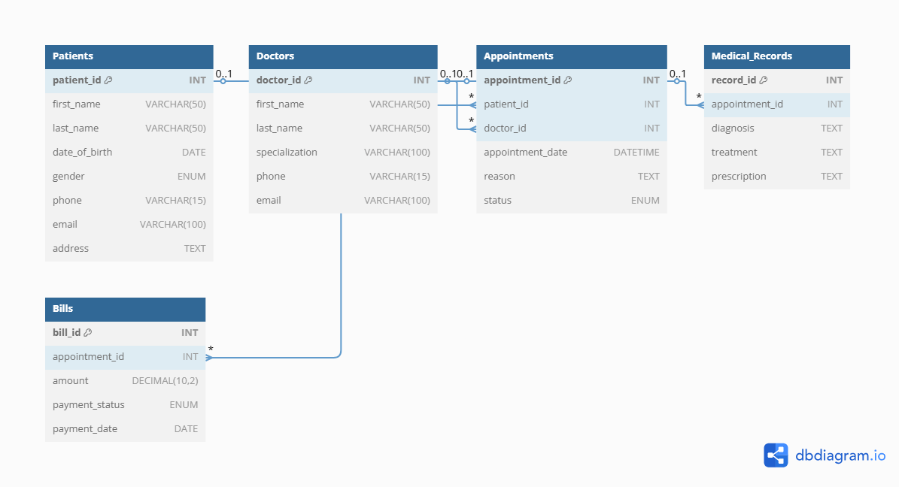

# 🏥 Clinic Booking System - MySQL Project

## 📋 Project Description

This project implements a full-featured **Clinic Booking System** using **MySQL**. The database supports managing:

- Patient records
- Doctor profiles
- Appointments between patients and doctors
- Medical records from each appointment
- Billing for services

It demonstrates the use of **relational database design** with real-world relationships (1-to-1, 1-to-many, many-to-many), and proper use of SQL constraints (PK, FK, NOT NULL, UNIQUE, ENUM, etc.).


## ⚙️ How to Run / Setup

1. **Clone the Repository**:
   ```bash
   git clone https://github.com/your-username/clinic-booking-system.git
   cd clinic-booking-system


## 🗺️ ERD (Entity Relationship Diagram)

📷 **Screenshot**:


---

## 📁 Files Included

| File                        | Description                                                                |
| --------------------------- | -------------------------------------------------------------------------- |
| `clinic_booking_system.sql` | Well-commented SQL file with all `CREATE TABLE` statements and constraints |
| `README.md`                 | Project overview and setup guide                                           |

---

## 👨‍💻 Author

Brandon Cheruiyot
[GitHub Profile](https://github.com/kigenbrandon)

